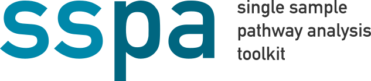

# sspa


[](https://badge.fury.io/py/sspa)
[](https://zenodo.org/badge/latestdoi/442446643)
[](https://cwieder.github.io/py-ssPA/)
[](https://pepy.tech/project/sspa)
[](https://www.gnu.org/licenses/gpl-3.0)

## Single sample pathway analysis toolkit
sspa provides a Python interface for metabolomics pathway analysis. In addition to conventional methods over-representation analysis (ORA) and gene/metabolite set enrichment analysis (GSEA), it also provides a wide range of single-sample pathway analysis (ssPA) methods. 

## Features
- Over-representation analysis
- Metabolite set enrichment analysis (based on GSEA)
- Single-sample pathway analysis
- Compound identifier conversion
- Pathway database download (KEGG, Reactome, and MetExplore metabolic networks)

Although this package is designed to provide a user-friendly interface for metabolomics pathway analysis, the methods are also applicable to other datatypes such as normalised RNA-seq data. 

## Documentation and tutorials
Full walkthrough notebook available on Google Colab:

[](https://colab.research.google.com/drive/1ehkbfThZ_6V-Lx-ya3Xe6DKAC77ZFL2I?usp=sharing)

Documentation is available on our [Read the Docs page](https://cwieder.github.io/py-ssPA/)

## Quickstart
```
pip install sspa
```
Load Reactome pathways
```
reactome_pathways  = sspa.process_reactome(organism="Homo sapiens")
```

Load some example metabolomics data in the form of a pandas DataFrame:

```
covid_data_processed = sspa.load_example_data(omicstype="metabolomics", processed=True)
```

Generate pathway scores using kPCA method

```
kpca_scores = sspa.sspa_kpca(covid_data_processed, reactome_pathways)
```

## Loading pathways 
```
# Pre-loaded pathways
# Reactome v78
reactome_pathways  = sspa.process_reactome(organism="Homo sapiens")

# KEGG v98
kegg_human_pathways  = sspa.process_kegg(organism="hsa")
```

Load a custom GMT file (extension .gmt or .csv)
```
custom_pathways = sspa.process_gmt("wikipathways-20220310-gmt-Homo_sapiens.gmt")
```

Download latest version of pathways
```
# download KEGG latest
kegg_mouse_latest = sspa.process_kegg("mmu", download_latest=True, filepath=".")

# download Reactome latest
reactome_mouse_latest = sspa.process_reactome("Mus musculus", download_latest=True, filepath=".")
```

## Identifier harmonization 
```
# download the conversion table
compound_names = processed_data.columns.tolist()
conversion_table = sspa.identifier_conversion(input_type="name", compound_list=compound_names)

# map the identifiers to your dataset
processed_data_mapped = sspa.map_identifiers(conversion_table, output_id_type="ChEBI", matrix=processed_data)
```

## Conventional pathway analysis
ORA
```
ora = sspa.sspa_ora(processed_data_mapped, covid_data["Group"], reactome_pathways, 0.05, DA_testtype='ttest', custom_background=None)

# perform ORA 
ora_res = ora.over_representation_analysis()

# get t-test results
ora.ttest_res

# obtain list of differential molecules input to ORA
ora.DA_test_res
```

GSEA
```
sspa.sspa_gsea(processed_data_mapped, covid_data['Group'], reactome_pathways)
```

## Single sample pathway analysis methods
```
# ssclustPA
ssclustpa_res = sspa.sspa_ssClustPA(processed_data_mapped, reactome_pathways)

# kPCA
kpca_scores = sspa.sspa_kpca(processed_data_mapped, reactome_pathways)

# z-score
zscore_res = sspa.sspa_zscore(processed_data_mapped, reactome_pathways)

# SVD (PLAGE)
svd_res = sspa.sspa_svd(processed_data_mapped, reactome_pathways)

# ssGSEA
ssgsea_res = sspa.sspa_ssGSEA(processed_data_mapped, reactome_pathways)
```


## License
GNU GPL 3.0

## Citing us
[](https://zenodo.org/badge/latestdoi/442446643)

If you found this package useful, please consider citing us:

ssPA package
```
@article{Wieder22a,
   author = {Cecilia Wieder and Nathalie Poupin and Clément Frainay and Florence Vinson and Juliette Cooke and Rachel PJ Lai and Jacob G Bundy and Fabien Jourdan and Timothy MD Ebbels},
   doi = {10.5281/ZENODO.6959120},
   month = {8},
   title = {cwieder/py-ssPA: v1.0.4},
   url = {https://zenodo.org/record/6959120},
   year = {2022},
}
```


Single-sample pathway analysis in metabolomics
```
@article{Wieder2022,
   author = {Cecilia Wieder and Rachel P J Lai and Timothy M D Ebbels},
   doi = {10.1186/s12859-022-05005-1},
   issn = {1471-2105},
   issue = {1},
   journal = {BMC Bioinformatics},
   pages = {481},
   title = {Single sample pathway analysis in metabolomics: performance evaluation and application},
   volume = {23},
   url = {https://doi.org/10.1186/s12859-022-05005-1},
   year = {2022},
}

```

## Contributing
Read our [contributor's guide](https://github.com/cwieder/py-ssPA/blob/main/CONTRIBUTING.md) to get started

### Contributors
We are grateful for our contributors who help develop and maintain py-ssPA:
- Maëlick Brochut [@mbrochut](https://github.com/mbrochut)

## News 

### [v0.2.3] - 23/06/23
- @mbrochut Bug fix in KEGG pathway downloader 
- @mbrochut Add tqdm progress bar for long KEGG downloads

### [v0.2.1] - 05/01/23
- Removal of rpy2 dependency for improved compatibility across systems
- Use [GSEApy](https://github.com/zqfang/GSEApy) as backend for GSEA and ssGSEA 
- Minor syntax changes
   - `ora.ttest_res` is now `ora.DA_test_res` (as we can implement t-test or MWU tests)
   - `sspa_fgsea()` is now `sspa_gsea()` and uses gseapy as the backend rather than R fgsea
   - `sspa_gsva()` is temporarily deprecated due to the need for the rpy2 compatability - use the [GSVA R package](https://bioconductor.org/packages/release/bioc/html/GSVA.html)
<!-- - Allow download of gene/protein pathways from KEGG and Reactome -->