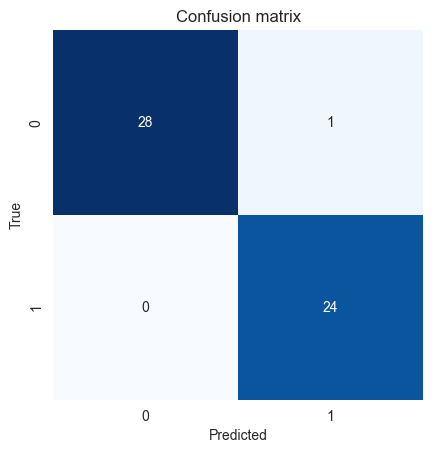
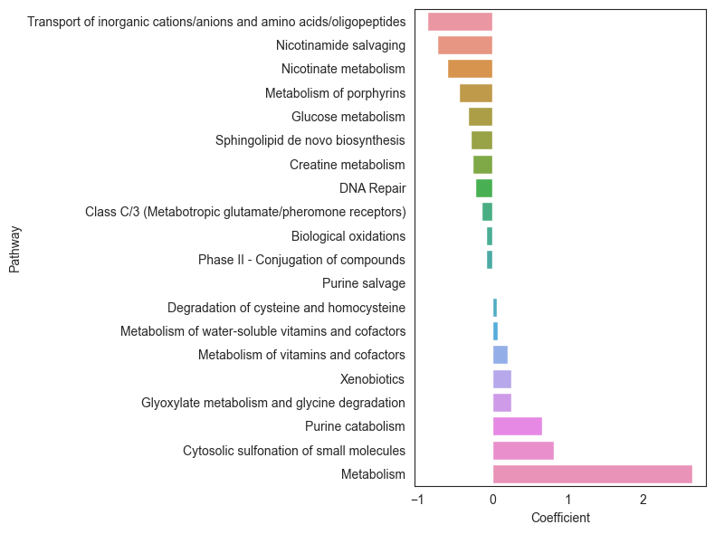

# SKlearn-enabled machine learning using ssPA scores
We will use a simple example to demonstrate how to use the sspa scores as features in a machine learning model. We will use ssPA scores generated using the `sspa.sspa_SVD` (PLAGE) method as input to a logistic regression model to predict COVID-19 status.

Import required packages:
```python
from sklearn.linear_model import LogisticRegression
from sklearn.model_selection import train_test_split
from sklearn.preprocessing import StandardScaler
from sklearn.metrics import roc_auc_score, accuracy_score
from sklearn.metrics import confusion_matrix
```
Convert COVID status to binary labels
```python
labels = [1 if i == "COVID19 " else 0 for i in covid_data["Group"]]
```

Split the data into training and test sets

```python
X_train, X_test, y_train, y_test = train_test_split(covid_data.iloc[:, :-2], labels, test_size=0.2, random_state=42)
```

Standardise the data
    
```python
scaler = StandardScaler().fit(X_train)
X_train = pd.DataFrame(scaler.transform(X_train), columns=X_train.columns, index=X_train.index)
X_test = pd.DataFrame(scaler.transform(X_test), columns=X_test.columns, index=X_test.index)
```

Create ssPA scores for test and train data separately
```python
sspa_svd_transformer = sspa.sspa_SVD(reactome_pathways, min_entity=3).fit(X_train)
sspa_train = sspa_svd_transformer.transform(X_train)
sspa_test = sspa_svd_transformer.transform(X_test)
```

We can now fit the model based on pathway scores
```python
# Create a logistic regression model
clf = LogisticRegression(penalty='l1', solver='liblinear', random_state=42, max_iter=1000)
clf.fit(sspa_train, y_train)

# Predict the test set
y_pred = clf.predict(sspa_test)
```
And evaluate the model performance

```python
# Calculate the accuracy
print("Accuracy:", accuracy_score(y_test, y_pred))

# Calculate the AUC
print("AUC:", roc_auc_score(y_test, y_pred))

# Plot the confusion matrix
cm = confusion_matrix(y_test, y_pred)
sns.set_style('white')
sns.heatmap(cm, annot=True, fmt='g', cmap='Blues', cbar=False, square=True)
plt.xlabel('Predicted')
plt.ylabel('True')
plt.title('Confusion matrix')
plt.show()
```


We can also interpret the model in terms of pathways by looking at feature importance. In this case we will look at the regression coefficients of the logistic regression model.
    
```python
# Exract the coefficients from the model
coef = pd.DataFrame(clf.coef_.T, index=sspa_train.columns, columns=["Coefficient"])
coef["Pathway"] = coef.index.map(dict(zip(reactome_pathways.index, reactome_pathways['Pathway_name'])))
coef = coef.sort_values(by="Coefficient")

# filter out non-zero coefficients
coef_filt = coef[coef["Coefficient"] != 0]

# Plot the coefficients
plt.figure(figsize=(8, 6))
sns.barplot(data=coef_filt, x="Coefficient", y="Pathway")
plt.tight_layout()
plt.show()
```


### Using ssPA functions as part of SKLearn pipelines
We may want to apply an ssPA transformation as part of a pre-processing pipeline to prepare test-train splits. We can integrate ssPA functions into sklearn pipelines like so:
```python
# create pipeline for missing value imputation, standardisation, and sspa transformation
from sklearn.pipeline import Pipeline
from sklearn.impute import SimpleImputer

# create pipeline
sspa_pipeline = Pipeline([
    ('imputer', SimpleImputer(strategy='median').set_output(transform="pandas")),
    ('scaler', StandardScaler().set_output(transform="pandas")),
    ('sspa', sspa_KPCA(reactome_pathways, min_entity=5))
])

# apply the pipeline to test and train data
sspa_train = sspa_pipeline.fit_transform(X_train)
sspa_test = sspa_pipeline.transform(X_test)
```