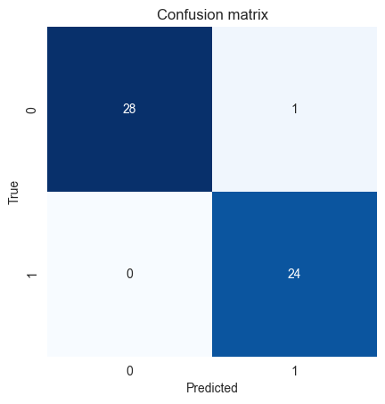
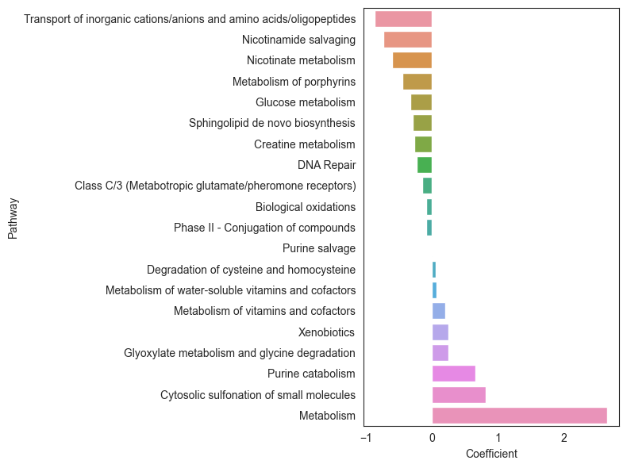

Please see our interactive walkthrough tutorial for a detailed overview on the package functionalities:

[](https://colab.research.google.com/drive/1ehkbfThZ_6V-Lx-ya3Xe6DKAC77ZFL2I?usp=sharing)

A local version of this tutorial is available to download from [GitHub](https://github.com/cwieder/py-ssPA/blob/main/sspa_walkthrough_local.ipynb).

# Quickstart quide

Load Reactome pathways
```python
reactome_pathways = sspa.process_reactome(organism="Homo sapiens")
```

Load some example metabolomics data in the form of a pandas DataFrame:

```python
covid_data_processed = sspa.load_example_data(omicstype="metabolomics", processed=True)
```

Generate pathway scores using kPCA method

```python
kpca_scores = sspa.sspa_KPCA(reactome_pathways, min_entity=3).fit_transform(covid_data_processed.iloc[:, :-2])
```

# Input data
The input data should consist of an $m×n$ pandas DataFrame of values corresponding to the abundance of all annotated metabolites, either as absolute (concentrations) or relative (peak intensities) quantifications. Rows represent $m$ samples and columns represent $n$ annotated compounds. 

Sample metadata is necessary for some types of pathway analysis, particularly the conventional methods over-representation analysis (ORA) and gene set enrichment analysis (GSEA). Sample metadata should contain details of the clinical outcome or phenotype used for comparison and should be represented as a column either as part of the metabolite abundance DataFrame, or as a separate column/Series, as long as the sample identifiers can be matched between data structures. 

??? example

    Below is a condensed example of the input data format:

    | sample\_id | spermidine | 1-methylnicotinamide | 12,13-DiHOME | alpha-ketoglutarate | kynurenate | Group |
    | ---------- | ---------- | -------------------- | ------------ | ------------------- | ---------- | ----- |
    | 1004596    | \-0.756979 | 0.552163             | \-0.317382   | 0.726321            | \-0.608606 | A     |
    | 1008097    | 0.079818   | \-0.839393           | 0.49128      | \-1.867786          | \-0.044496 | A     |
    | 1008631    | 0.978372   | \-1.281277           | \-0.199487   | 0.355229            | 0.014784   | B     |
    | 1012545    | \-0.93754  | \-0.242391           | 1.63653      | 2.080704            | \-0.31561  | B     |
    | 1022407    | \-0.652496 | \-0.110733           | 0.814461     | \-0.886903          | 0.409608   | B     |

    The index are sample identifiers and the column names are metabolite names/identifiers. Metdata columns can also be added at the end of the DataFrame.

# Loading pathways 
```python
# Pre-loaded pathways
# Reactome v78
reactome_pathways  = sspa.process_reactome(organism="Homo sapiens")

# KEGG v98
kegg_human_pathways  = sspa.process_kegg(organism="hsa")
```

Load a custom GMT file (extension .gmt or .csv)
```python
custom_pathways = sspa.process_gmt("wikipathways-20220310-gmt-Homo_sapiens.gmt")
```

Download latest version of pathways
```python
# download KEGG latest
kegg_mouse_latest = sspa.process_kegg("mmu", download_latest=True, filepath=".")

# download Reactome latest
reactome_mouse_latest = sspa.process_reactome("Mus musculus", download_latest=True, filepath=".")
```

!!! note

    Downloading the lastest version of KEGG pathways can take up to ten minutes. 

# Identifier harmonization 
```python
# download the conversion table
compound_names = processed_data.columns.tolist()
conversion_table = sspa.identifier_conversion(input_type="name", compound_list=compound_names)

# map the identifiers to your dataset
processed_data_mapped = sspa.map_identifiers(conversion_table, output_id_type="ChEBI", matrix=processed_data)
```

!!! warning

    This step requries active internet connection and access to the MetaboAnalyst API. If you are experiencing errors please check you are able to query the [API](https://www.metaboanalyst.ca/docs/APIs.xhtml).

# Conventional pathway analysis
ORA
```python
ora = sspa.sspa_ora(processed_data_mapped, covid_data["Group"], reactome_pathways, 0.05, DA_testtype='ttest', custom_background=None)

# perform ORA 
ora_res = ora.over_representation_analysis()

# get t-test results
ora.ttest_res

# obtain list of differential molecules input to ORA
ora.DA_test_res
```

!!! note "Statistical tests for selecing differential molecules"
    In over-representation the list of molecules of interest, or 'differential genes/metabolites/proteins, etc' are often determined using a statistical test such as the Student's t-test. In the sspa_ora function we allow users to specify the type of test used for this purpose, either `DA_testtype='ttest'` to use an independent samples t-test (default), or `DA_testtype='mwu'` to use a Mann Whitney U test. 

GSEA
```python
sspa.sspa_gsea(processed_data_mapped, covid_data['Group'], reactome_pathways)
```

# Single sample pathway analysis methods
All ssPA methods now have a `fit()`, `transform()` and `fit_transform()` method for compatibility with SciKitLearn. This allows integration of ssPA transformation with various machine learning functions in SKLearn such as `Pipeline` and `GridSearchCV`. Specifically for `sspa.sspa_ssClustPA`, `sspa.sspa_SVD`, and `sspa.sspa_KPCA` methods the model can be fit on the training data and the test data is transformed using the fitted model.
```
# ssclustPA
ssclustpa_res = sspa.sspa_ssClustPA(reactome_pathways, min_entity=2).fit_transform(processed_data_mapped)

# kPCA 
kpca_scores = sspa.sspa_kpca(reactome_pathways, min_entity=2).fit_transform(processed_data_mapped)

# z-score (Lee et al. 2008)
zscore_res = sspa.sspa_zscore(reactome_pathways, min_entity=2).fit_transform(processed_data_mapped)

# SVD (PLAGE, Tomfohr et al. 2005)
svd_res = sspa.sspa_svd(reactome_pathways, min_entity=2).fit_transform(processed_data_mapped)

# ssGSEA (Barbie et al. 2009)
ssgsea_res = sspa.sspa_ssGSEA(reactome_pathways, min_entity=2).fit_transform(processed_data_mapped)
```

# SKlearn-enabled machine learning using ssPA scores
We will use a simple example to demonstrate how to use the sspa scores as features in a machine learning model. We will use ssPA scores generated using the `sspa.sspa_SVD` (PLAGE) method as input to a logistic regression model to predict COVID-19 status.

Import required packages:
```python
from sklearn.linear_model import LogisticRegression
from sklearn.model_selection import train_test_split
from sklearn.preprocessing import StandardScaler
from sklearn.metrics import roc_auc_score, accuracy_score
from sklearn.metrics import confusion_matrix
```
Convert COVID status to binary labels
```python
labels = [1 if i == "COVID19 " else 0 for i in covid_data["Group"]]
```

Split the data into training and test sets

```python
X_train, X_test, y_train, y_test = train_test_split(covid_data.iloc[:, :-2], labels, test_size=0.2, random_state=42)
```

Standardise the data
    
```python
scaler = StandardScaler().fit(X_train)
X_train = pd.DataFrame(scaler.transform(X_train), columns=X_train.columns, index=X_train.index)
X_test = pd.DataFrame(scaler.transform(X_test), columns=X_test.columns, index=X_test.index)
```

Create ssPA scores for test and train data separately
```python
sspa_svd_transformer = sspa.sspa_SVD(reactome_pathways, min_entity=3).fit(X_train)
sspa_train = sspa_svd_transformer.transform(X_train)
sspa_test = sspa_svd_transformer.transform(X_test)
```

We can now fit the model based on pathway scores
```python
# Create a logistic regression model
clf = LogisticRegression(penalty='l1', solver='liblinear', random_state=42, max_iter=1000)
clf.fit(sspa_train, y_train)

# Predict the test set
y_pred = clf.predict(sspa_test)
```
And evaluate the model performance

```python
# Calculate the accuracy
print("Accuracy:", accuracy_score(y_test, y_pred))

# Calculate the AUC
print("AUC:", roc_auc_score(y_test, y_pred))

# Plot the confusion matrix
cm = confusion_matrix(y_test, y_pred)
sns.set_style('white')
sns.heatmap(cm, annot=True, fmt='g', cmap='Blues', cbar=False, square=True)
plt.xlabel('Predicted')
plt.ylabel('True')
plt.title('Confusion matrix')
plt.show()
```


We can also interpret the model in terms of pathways by looking at feature importance. In this case we will look at the regression coefficients of the logistic regression model.
    
```python
# Exract the coefficients from the model
coef = pd.DataFrame(clf.coef_.T, index=sspa_train.columns, columns=["Coefficient"])
coef["Pathway"] = coef.index.map(dict(zip(reactome_pathways.index, reactome_pathways['Pathway_name'])))
coef = coef.sort_values(by="Coefficient")

# filter out non-zero coefficients
coef_filt = coef[coef["Coefficient"] != 0]

# Plot the coefficients
plt.figure(figsize=(8, 6))
sns.barplot(data=coef_filt, x="Coefficient", y="Pathway")
plt.tight_layout()
plt.show()
```


### Using ssPA functions as part of SKLearn pipelines
We may want to apply an ssPA transformation as part of a pre-processing pipeline to prepare test-train splits. We can integrate ssPA functions into sklearn pipelines like so:
```python
# create pipeline for missing value imputation, standardisation, and sspa transformation
from sklearn.pipeline import Pipeline
from sklearn.impute import SimpleImputer

# create pipeline
sspa_pipeline = Pipeline([
    ('imputer', SimpleImputer(strategy='median').set_output(transform="pandas")),
    ('scaler', StandardScaler().set_output(transform="pandas")),
    ('sspa', sspa_KPCA(reactome_pathways, min_entity=5))
])

# apply the pipeline to test and train data
sspa_train = sspa_pipeline.fit_transform(X_train)
sspa_test = sspa_pipeline.transform(X_test)
```